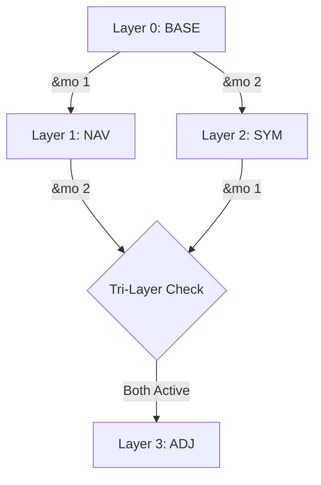

# Toucan Keymap Visualization

## Layer Logic (Mermaid)

## Layer 0: BASE (Default)

| Left | | | | | | Right | | | | | |
| :-: | :-: | :-: | :-: | :-: | :-: | :-: | :-: | :-: | :-: | :-: | :-: |
| TAB | Q | W | E | R | T | Y | U | I | O | P | BSPC |
| LCTRL | A | S | D | F | G | H | J | K | L | ; | ' |
| LSHFT | Z | X | C | V | B | N | M | , | . | / | ESC |
| | | **LGUI** | **SPACE** | | | **RET** | **RALT** | | |

## Layer 1: NAV (Navigation & Numbers)

| Left | | | | | | Right | | | | | |
| :-: | :-: | :-: | :-: | :-: | :-: | :-: | :-: | :-: | :-: | :-: | :-: |
| TAB | 1 | 2 | 3 | 4 | 5 | 6 | 7 | 8 | 9 | 0 | BSPC |
| LCTRL | ▽ | ▽ | ▽ | ▽ | ▽ | ← | ↓ | ↑ | → | ▽ | ▽ |
| LSHFT | ▽ | ▽ | ▽ | ▽ | ▽ | CTRL+← | PG_DN | PG_UP | CTRL+→ | ▽ | ▽ |
| | | **LGUI** | **SPACE** | | | **RET** | **RALT** | | |

*Note: `▽` indicates transparent (pass-through to lower layer)*

## Layer 2: SYM (Symbols)

| Left | | | | | | Right | | | | | |
| :-: | :-: | :-: | :-: | :-: | :-: | :-: | :-: | :-: | :-: | :-: | :-: |
| TAB | 1 | 2 | 3 | 4 | 5 | 6 | 7 | * | 9 | 0 | BSPC |
| CTRL+Z | ▽ | CTRL+C | CTRL+V | CTRL+X | ▽ | - | = | [ | ] | \ | ` |
| LSHFT | LCTRL | ▽ | LCTRL | LCTRL | LCTRL | - | = | [ | ] | \ | ` |
| | | **LGUI** | **SPACE** | | | **RET** | **RALT** | | |

## Layer 3: ADJ (Adjust & Media)

Activated when both NAV and SYM layers are active (Tri-layer).

| Left | | | | | | Right | | | | | |
| :-: | :-: | :-: | :-: | :-: | :-: | :-: | :-: | :-: | :-: | :-: | :-: |
| TAB | UNLOCK | F7 | F8 | F9 | F12 | VOL_DN | MUTE | VOL_UP | ▽ | ▽ | BSPC |
| LCTRL | UNLOCK | F4 | F5 | F6 | F11 | ▽ | ▽ | ▽ | ▽ | ▽ | ▽ |
| LSHFT | F1 | F2 | F3 | F10 | ▽ | ▽ | ▽ | ▽ | ▽ | ▽ | LGUI |
| | | **LANG2** | **SPACE** | | | **RET** | **RALT** | **LANG1** | |
